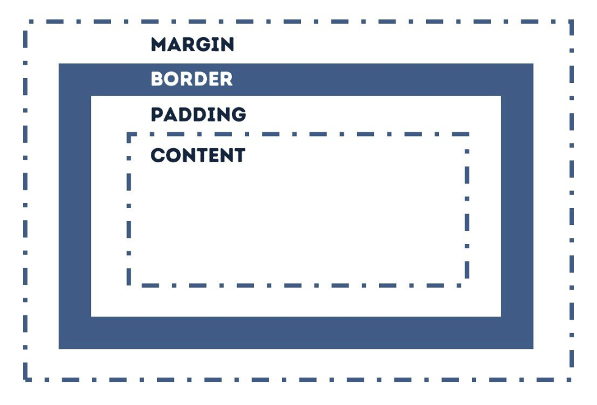

# BANGUNAN INTI JAYA
E-Commerce Web Application for All Your Building Needs

### 🪤 Deployment
Explore the live version of the site here: [INTI JAYA Webpage](http://cleo-excellen-intijaya.pbp.cs.ui.ac.id/)

---
- [Tugas 2: Implementasi MVT pada Django](#pbp-c---tugas-2)
- [Tugas 3: Implementasi Form dan Data Delivery pada Django](#pbp-c---tugas-3)
- [Tugas 4: Implementasi Autentikasi, Session, dan Cookies pada Django](#pbp-c---tugas-4)
- [Tugas 5: Desain Web menggunakan HTML, CSS dan Framework CSS](#pbp-c---tugas-5)
---
## PBP C - Tugas 2

### Cara Pengimplementasian 🐾

1. **Membuat Proyek Django Baru.**
   - Langkah awal adalah menginisialisasi proyek Django dengan menggunakan perintah `django-admin startproject [nama_proyek]`. Perintah ini akan menghasilkan struktur direktori dasar yang diperlukan untuk menjalankan proyek Django saya.

2. **Membuat Aplikasi Bernama "main" pada Proyek.**
   - Setelah proyek Django diinisialisasi, langkah berikutnya saya menambahkan aplikasi bernama "main" dengan menjalankan perintah `python manage.py startapp main`. Aplikasi ini akan menjadi tempat untuk menyimpan semua logika dan fitur yang akan dikembangkan dalam proyek saya.

3. **Melakukan Routing Proyek untuk Menjalankan Aplikasi "main".**
   - Di dalam file `urls.py` proyek, kita tambahkan konfigurasi rute yang mengarahkan permintaan (request) ke aplikasi "main". Langkah ini memastikan bahwa aplikasi "main" terhubung dengan proyek dan dapat diakses melalui URL yang sesuai.

4. **Membuat Model Product pada Aplikasi "main" dengan Atribut.**
   - Di dalam file `models.py` pada aplikasi "main", definisikan model Product yang menggambarkan entitas produk. Model ini akan mencakup atribut wajib seperti `name`, `description`, `price`, dan saya menambahkan `quantity` dan `categories`, yang akan digunakan untuk menyimpan informasi produk ke dalam database.

5. **Membuat Fungsi di views.py untuk Merender Template HTML dengan Nama Aplikasi serta Nama dan Kelas saya.**
   - Di dalam file `views.py`, buatlah sebuah fungsi yang akan merender template HTML. Template ini akan menampilkan informasi seperti nama aplikasi, nama, dan kelas saya, yang akan disediakan oleh fungsi tersebut.

6. **Menambahkan Routing di urls.py Aplikasi "main" untuk Memetakan Fungsi di views.py.**
   - Di file `urls.py` pada aplikasi "main", tambahkan rute baru yang menghubungkan URL dengan fungsi yang telah saya buat di `views.py`. Ini menjadikan pengguna dapat mengakses halaman yang telah dibuat melalui URL yang telah saya tentukan.

7. **Melakukan Deployment ke PWS agar Bisa diakses melalui Internet.**
   - Setelah aplikasi selesai dibuat, lakukan proses deployment ke Pacil Web Service (PWS). Ini mencakup mengunggah proyek ke server PWS agar aplikasi dapat diakses secara online oleh teman-teman saya melalui Internet.

8. **Membuat README.md yang berisi tautan menuju aplikasi PWS yang sudah di-deploy, serta jawaban dari beberapa pertanyaan berikut.**
   - Tahap akhir membuat file `README.md` yang berisi deskripsi proyek, langkah-langkah implementasi, serta tautan menuju aplikasi yang sudah di-deploy di PWS. Sertakan juga jawaban untuk pertanyaan yang relevan tentang Django dan fungsionalitasnya untuk menambah pemahaman kita.

### Alur Django 🔍 


- Bagan alur request dalam aplikasi web Django dimulai ketika client (browser) mengirimkan permintaan (request) ke server. Proses pertama adalah **`urls.py`**, memetakan URL yang diminta ke fungsi yang tepat di **`views.py`**. Di **`views.py`**, request diproses, dan bila diperlukan, berinteraksi dengan  **`models.py`** untuk mengambil atau menyimpan data dari database. Setelah pengolahan data di **`views.py`**, template HTML (pada folder templates) dirender dan hasilnya dikirim kembali ke client sebagai respon. Jika kita menarik kesimpulan,  **`urls.py`** mengatur arah request, **`views.py`** menangani logika aplikasi, **`models.py`** mengelola data, dan berkas HTML menampilkan informasi kepada pengguna.

### Fungsi Git 🖇️
- Git adalah alat kontrol versi yang memungkinkan pengembang perangkat lunak untuk melacak setiap perubahan dalam kode secara mendetail. Dengan Git, tim pengembang dapat bekerja bersama dalam satu proyek, mengelola berbagai cabang (branch) untuk fitur baru atau perbaikan bug, serta menggabungkan perubahan (merge) dengan aman. Git juga menyediakan kemampuan untuk kembali ke versi sebelumnya jika terjadi kesalahan, sehingga mengurangi risiko dalam proses pengembangan perangkat lunak. Dengan demikian, Git membantu menjaga konsistensi kode dan meningkatkan efisiensi kerja tim dalam proyek yang kompleks.                                                                                                      

### Mengapa Django yang dijadikan permulaan pembelajaran pengembangan perangkat lunak? 🖌️📚
- Django sering dipilih sebagai framework pembelajaran awal karena mendukung pengembangan cepat (rapid development) dan menerapkan praktik terbaik seperti arsitektur Model-View-Template (MVT). Kesederhanaannya memungkinkan pemula memahami konsep dasar seperti templating, routing, dan manajemen database tanpa harus menghadapi kode yang kompleks. Dokumentasi dan komunitas yang luas mempermudah pemula dalam menemukan solusi serta sumber belajar yang baik.

### Mengapa model pada Django disebut Object-Relational Mapping / ORM ? 💭
- Model Django dikenal sebagai ORM (Object-Relational Mapping) karena memungkinkan pemetaan objek Python ke database relasional. Dengan menggunakan ORM, pengembang dapat mengelola database melalui kode Python tanpa harus menulis kueri SQL secara langsung. ORM menyederhanakan interaksi dengan database, memastikan kode tetap terstruktur dan mudah dipahami, dan mempermudah olah data.

---
## PBP C - Tugas 3

### Jelaskan mengapa kita memerlukan data delivery dalam pengimplementasian sebuah platform?
- Data delivery adalah komponen penting yang memungkinkan berbagai elemen platform berkomunikasi secara lancar, aman, dan tepat waktu. Ini memastikan data mengalir dengan baik antara server, klien, dan antarmuka pengguna. Tanpa data delivery, elemen-elemen platform akan terisolasi dan tidak dapat berfungsi optimal. Selain itu, mekanisme ini juga mendukung skalabilitas dan kemampuan platform beradaptasi dengan kebutuhan yang berubah serta menangani lonjakan lalu lintas data.

---
### Menurutmu, mana yang lebih baik antara XML dan JSON? Mengapa JSON lebih populer dibandingkan XML?
- Menurut saya, jika melihat format pertukaran data yang sering digunakan, JSON lebih unggul dibandingkan XML. Berikut beberapa alasan mengapa saya memilih JSON yang lebih populer:

1. Kesederhanaan: Sintaks JSON lebih sederhana karena tidak memerlukan tag pembuka dan penutup seperti XML. Struktur JSON juga sangat mirip dengan objek dan array dalam JavaScript, sehingga lebih mudah digunakan.
2. Ukuran File: JSON menghasilkan file yang lebih kecil karena tidak perlu menggunakan tag penutup, membuatnya lebih efisien dalam hal penyimpanan dan pengiriman data.
3. Kecepatan Parsing: JSON bisa diparse menjadi objek JavaScript dengan sangat cepat, memberikan performa yang lebih baik dalam aplikasi web.
4. Struktur Data Fleksibel: JSON mendukung tipe data seperti array dan objek bersarang (nested objects) dengan lebih alami dibandingkan XML.
5. Popularitas dalam API: Banyak API modern menggunakan JSON karena lebih mudah diimplementasikan, terutama untuk pengembangan aplikasi web dan mobile.

---
### Jelaskan fungsi dari method is_valid() pada form Django dan mengapa kita membutuhkan method tersebut?
- Method `is_valid()` pada form Django memiliki peran penting dalam memvalidasi data yang dimasukkan oleh pengguna. Fungsinya adalah untuk memeriksa apakah data yang dikirim melalui form telah memenuhi semua aturan validasi, seperti apakah field yang wajib sudah diisi, format data sudah benar, atau apakah data sesuai dengan batasan yang telah ditetapkan. Jika data valid, method ini akan mengembalikan `True`, sementara jika ada kesalahan, akan mengembalikan `False` dan Django akan mengisi dictionary `form.errors` dengan pesan kesalahan yang sesuai untuk setiap field yang tidak valid. Selain itu, `is_valid()` membantu mencegah data yang tidak valid atau berbahaya masuk ke dalam sistem, melindungi aplikasi dari potensi bug dan ancaman keamanan. Singkatnya, method ini akan memvalidasi data yang dikirim oleh pengguna sesuai aturan yang telah ditentukan di form. Jika data valid, maka dapat diproses lebih lanjut (misalnya, disimpan ke database). Jika tidak valid, method akan mengembalikan `False` dan menampilkan pesan error. Tanpa `is_valid()`, kita tidak dapat menjamin bahwa data yang diterima aman dan sesuai, yang bisa mengakibatkan masalah pada aplikasi.

---
###  Mengapa kita membutuhkan csrf_token saat membuat form di Django? Apa yang dapat terjadi jika kita tidak menambahkan csrf_token pada form Django? Bagaimana hal tersebut dapat dimanfaatkan oleh penyerang?
- csrf_token digunakan untuk melindungi aplikasi Django dari serangan Cross-Site Request Forgery (CSRF). Serangan CSRF terjadi ketika penyerang membuat permintaan berbahaya ke server menggunakan kredensial pengguna yang sudah terautentikasi, tanpa sepengetahuan pengguna. Dengan adanya csrf_token, server dapat memverifikasi bahwa permintaan yang dibuat berasal dari situs yang sah dan bukan dari sumber eksternal berbahaya. Jika kita tidak menyertakan csrf_token dalam form Django, penyerang dapat membuat situs atau skrip berbahaya yang mengirimkan permintaan ke aplikasi Django dengan memanfaatkan kredensial pengguna yang sedang login. Permintaan palsu tersebut akan tampak sah karena dikirim dari browser pengguna yang terautentikasi, dan tanpa csrf_token, server tidak dapat membedakan mana permintaan asli dan mana yang palsu. Hal ini memungkinkan penyerang untuk mengubah data sensitif, mencuri informasi pribadi, atau melakukan transaksi yang tidak sah.

###  Jelaskan bagaimana cara kamu mengimplementasikan checklist di atas secara step-by-step (bukan hanya sekadar mengikuti tutorial).
#### 1. Membuat Input Form untuk Menambahkan Objek Model

**Langkah-langkah**:
1. `base.html` untuk menjadi page utama 
    ```python
    
    <!DOCTYPE html>
    <html lang="en">
        <head>
            <meta charset="UTF-8">
            <meta name="viewport" content="width=device-width, initial-scale=1.0">
             
        </head>
        <body>
             
        </body>
    </html>
    ```
 2. Menambahkan `BASE_DIR` di dalam `settings.py` agar project dapat mengenali file HTML yang akan digunakan sebagai template utama.
    ```python
    'DIRS': [BASE_DIR / 'templates'],

3. Menambahkan atribut `id` pada model product
    ```python
    import uuid
   from django.db import models

   # Create your models here.
   class ProductEntry(models.Model):
      id = models.UUIDField(primary_key=True, default=uuid.uuid4, editable=False)
      name = models.CharField(max_length=255)
      price = models.IntegerField()
      description = models.TextField()
      quantity = models.IntegerField()
      categories = models.CharField(max_length=255)

      def __str__(self):
         return self.name
         ```
4. Membuat `forms.py` untuk mendeklarasikan atribut-atribut dari model yang membutuhkan input dari user
    ```python
    from django.forms import ModelForm
   from main.models import ProductEntry

   class ProductEntryForm(ModelForm):
      class Meta:
         Model = ProductEntry
         fields = ['name', 'price', 'description', 'quantity', 'categories']
    ```
5. Membuat method `show_main` untuk menampilkan di `main.html`
    ```python
    def show_main(request):
    products = ProductEntry.objects.all()

    context = {
        'npm': '2306244886',
        'nama': 'Cleo Excellen Iskandar',
        'kelas': 'PBP C',
        'shop_name':'INTI JAYA',  
        'product_entry' : products
    }

    return render(request, "main.html", context)
    ```
6. Membuat method `create_name_entry` untuk mengambil input user sesuai dengan `forms.py`
    ```python
    def create_name_entry(request):
        form = ProductEntryForm(request.POST or None)
        if form.is_valid() and request.method == 'POST':
            form.save()
            return redirect('main:show_main')
        context={'form':form}
        return render(request,'create_name_entry.html',context)
    ```
7. Membuat `show_xml`, `show_json`, `show_xml_by_id`, `show_json_by_id` untuk menampilkan response back dari input user
    ```python
    def show_xml(request):
        data = ProductEntry.objects.all()
        return HttpResponse(serializers.serialize("xml",data),content_type='application/xml')

    def show_json(request):
        data = ProductEntry.objects.all()
        return HttpResponse(serializers.serialize("json",data),content_type='application/json')

    def show_xml_by_id(request, id):
        data = ProductEntry.objects.filter(pk=id)
        return HttpResponse(serializers.serialize("xml", data), content_type="application/xml")

    def show_json_by_id(request, id):
        data = ProductEntry.objects.filter(pk=id)
        return HttpResponse(serializers.serialize("json", data), content_type="application/json")
    ```

8. Melakukan routing di dari method yang sudah dibuat di `urls.py`
   ```python
   from django.urls import path
   from main.views import show_main,create_name_entry,show_xml,show_json,show_xml_by_id,show_json_by_id

   app_name = 'main'

   urlpatterns = [
      path('', show_main, name='show_main'),
      path('create-name-entry', create_name_entry, name='create_name_entry'),
      path('xml/',show_xml,name='show_xml'),
      path('json/',show_json,name='show_json'),
      path('xml/<str:id>/', show_xml_by_id, name='show_xml_by_id'),
      path('json/<str:id>/', show_json_by_id, name='show_json_by_id'),
   ]
9.  Membuat `create_name_entry.html` untuk tampilan ketika web ingin meminta input dari pengguna.
      ```python
     
    
    <h1>Add Product Entry</h1>

    <form method="POST">
    
    <table>
        {{ form.as_table }}
        <tr>
        <td></td>
        <td>
            <input type="submit" value="Add Product Entry" />
        </td>
        </tr>
    </table>
    </form>

    
    ```
10. Membuat `main.html` untuk menampilkan product dari hasil input pengguna
      ```python
         
         
         <!DOCTYPE html>
         <html>
         <head>
            <title>Main Page</title>
         </head>
         <body>
            <h1>{{ shop_name }} by {{ nama }}</h1>
            <p>NPM: {{ npm }}</p>
            <p>Class: {{ kelas }}</p> 

            
            <p>Belum ada data produk.</p>
            
            <table>
               <tr>
               <th>Product Name</th>
               <th>Price</th>
               <th>Description</th>
               <th>Quantity</th>
               <th>Categories</th>
               </tr>

            
                  <tr>
                  <td>{{ product.name }}</td>
                  <td>{{ product.price }}</td>
                  <td>{{ product.description }}</td>
                  <td>{{ product.quantity }}</td>
                  <td>{{ product.categories }}</td>
                  </tr>
            
            </table>
               
               <br />
               <a href="">
                  <button>Add New Product Entry</button>
               </a>
         </body>
      </html>
      

# Screenshot Postman
## XML

## JSON 

## XML by Id

## JSON by Id


## PBP C - Tugas 4

### 1. Apa perbedaan antara HttpResponseRedirect() dan redirect()?
- Perbedaan antara HttpResponseRedirect() dan redirect() terletak pada cara dan fleksibilitas penggunaannya untuk melakukan redirect ke URL
- **`HttpResponseRedirect()`**:
    - kelas bawaan Django yang mengembalikan respon HTTP 302 untuk melakukan redirect ke URL yang ditentukan.
    - Cocok digunakan jika ingin memiliki kontrol lebih terhadap respon sebelum mengembalikannya
    - Contoh: Mengarah ke URL yang berada di luar domain situs, seperti Google
    ```python
    from django.http import HttpResponseRedirect

    def my_view(request):
        return HttpResponseRedirect('https://www.google.com')

    ```
- **`redirect()`**:
  - Merupakan fungsi shortcut dari Django yang secara internal menggunakan HttpResponseRedirect()
  - `Lebih praktis dan fleksibel karena bisa menerima berbagai jenis parameter seperti URL, named URL patterns, atau bahkan instance model.
  - Contoh:
    ```python
    from django.shortcuts import redirect
    
    def my_view(request):
        return redirect('url-name')
    ```
**Perbedaan Utama**: redirect() adalah pilihan yang lebih sederhana dan fleksibel dibandingkan HttpResponseRedirect(), terutama dalam hal menerima berbagai jenis parameter. Sebaliknya, HttpResponseRedirect() lebih cocok digunakan saat diperlukan kontrol lebih terhadap respons yang dikirimkan.

### 2. Menghubungkan model Product dengan User.

**Langkah-langkah**:

1. Membuka models.py pada subdirektori main dan tambahkan kode dibawah untuk mengimpor model:
    ```python
    from django.contrib.auth.models import User
    ```
2. Menambahkan potongan kode berikut pada model ProductEntry yang sudah dibuat
    ```python
    class ProductEntry(models.Model):
        user = models.ForeignKey(User, on_delete=models.CASCADE)
    ```
    - Menghubungkan satu product entry dengan satu user dengan relationship, yaitu sebuah product entry akan terasosiasi dengan seorang user
3. Pada views.py pada subdirektori main, saya mengubah fungsi create_name_entry dengan kode di bawah
    ```python
    def create_name_entry(request):
        form = ProductEntryForm(request.POST or None)
        if form.is_valid() and request.method == 'POST':
            name_entry = form.save(commit=False)
            name_entry.user = request.user
            name_entry.save()
            return redirect('main:show_main')
        context={'form':form}
        return render(request,'create_name_entry.html',context)
    ```
    - Parameter commit=False berguna untuk mencegah Django agar tidak langsung menyimpan objek yang telah dibuat dari form langsung ke database. kita mengisi field user dengan objek User dari return value request.user yang sedang terotorisasi untuk menandakan bahwa objek tersebut dimiliki oleh pengguna yang sedang login.

4. Mengubah value dari products dan context pada fungsi show_main
    ```python
    def show_main(request):
        products = ProductEntry.objects.filter(user=request.user)
        context = {
            'nama': request.user.username,
         ...
        }
    ```
5. Menyimpan semua perubahan, dan melakukan migrasi model dengan python manage.py makemigrations.
6. Pilih 1 untuk menetapkan default value untuk field user pada semua row yang telah dibuat pada database. Lalu Ketik angka 1 lagi untuk menetapkan user dengan ID 1 pada model yang sudah ada.

7. Melakukan python manage.py migrate untuk mengaplikasikan migrasi yang dilakukan.
8. Mempersiapkan aplikasi web untuk environtment production dengan mambahkan sebuah *import os* pada settings.py yang ada pada subdirektori intijaya
9. Mengganti variabel DEBUG dari berkas settings.py.
    ```python
    PRODUCTION = os.getenv("PRODUCTION", False)
    DEBUG = not PRODUCTION
    ```

### 3.  Apa perbedaan antara authentication dan authorization, apakah yang dilakukan saat pengguna login? Jelaskan bagaimana Django mengimplementasikan kedua konsep tersebut.

- **`Authentication`**:
    - Proses untuk memverifikasi identitas pengguna. Ini adalah langkah untuk memastikan bahwa seseorang atau entitas adalah siapa yang mereka klaim.
    - Contoh:
        Memasukkan username dan password saat login ke akun dan memasukkan kode OTP (One-Time Password) yang dikirim ke ponsel.
    - Jika dengan analogi ini seperti saat kita menunjukkan KTP ke petugas pintu masuk gedung untuk membuktikan bahwa kamu adalah orang yang berhak masuk.
    - Proses saat pengguna login yaitu, Pengguna memasukkan kredensial mereka. Lalu sistem memeriksa kredensial pada data yang tersimpan. Jika cocok, pengguna dinyatakan berhasil terotentikasi, dan sistem biasanya membuat sesi atau memberikan token untuk pengguna.
    - Django menyediakan authenticate() dan login() yang memverifikasi username dan password pengguna. Jika valid, sesi baru dibuat untuk pengguna tersebut
    ```python
    from django.contrib.auth import authenticate, login

        def my_login_view(request):
            username = request.POST['username']
            password = request.POST['password']
            user = authenticate(request, username=username, password=password)
            if user is not None:
                login(request, user)  # Create a session for the user
                return redirect('home')
            else:
                return HttpResponse('Invalid login')
    ```

- **`Authorization`**:
    - Proses untuk menentukan hak atau izin yang dimiliki pengguna setelah mereka terautentikasi. Ini memastikan bahwa pengguna hanya dapat mengakses sumber daya atau data yang diizinkan untuk mereka.
    - Contoh:
        Setelah login ke aplikasi, seorang admin dapat menambah atau menghapus pengguna, tetapi pengguna biasa hanya dapat melihat profil mereka sendiri.
    - Jika dengan analogi ini seperti setelah menunjukkan KTP dan diizinkan masuk ke gedung (autentikasi), kita hanya boleh masuk ke area tertentu, misalnya ruang lobby, bukan ke ruang admin.
    - Proses saat pengguna login yaitu Setelah terotentikasi, sistem memeriksa peran atau izin pengguna. Berdasarkan peran tersebut, sistem menentukan tindakan apa saja yang boleh diakses oleh pengguna tersebut.
    - Django menggunakan sistem izin (permissions) dan grup (groups) untuk mengatur otorisasi. Django juga menyediakan decorator @login_required untuk memastikan bahwa pengguna harus login untuk mengakses halaman tertentu, serta @permission_required untuk memastikan pengguna memiliki izin tertentu.
    ```python
    from django.contrib.auth.decorators import login_required, permission_required
    @login_required
    def dashboard(request):
        return render(request, 'dashboard.html')
    @permission_required('app_name.can_add_post')
    def add_post(request):
        return render(request, 'add_post.html')
    ```

### 4. Bagaimana Django mengingat pengguna yang telah login? Jelaskan kegunaan lain dari cookies dan apakah semua cookies aman digunakan?
- Django mengingat pengguna yang telah login menggunakan sesi (sessions) yang disimpan dalam cookies. Saat pengguna berhasil login, Django membuat sebuah sesi untuk pengguna tersebut. Django menyimpan informasi sesi di server (database, cache, atau file system) dan memberikan sebuah ID sesi unik kepada pengguna tersebut. ID sesi ini dikirimkan ke browser pengguna dalam bentuk cookie yang bernama sessionid. Setiap kali pengguna membuat permintaan (request) baru ke server, browser mengirimkan cookie sessionid tersebut kembali ke server. Django menggunakan ID sesi ini untuk mengambil informasi pengguna yang tersimpan di server, sehingga server bisa mengenali siapa pengguna yang sedang berinteraksi.
- Kegunaan lain dari cookies bisa menjadi Penyimpanan preferensi pengguna, pelacakan, keranjang belanja pada e-commerce, dan isa juga menyimpan token keamanan. 
- Tidak semua cookies aman digunakan. Cookies yang tidak dikelola dengan baik dapat rentan terhadap ancaman seperti Cross-Site Scripting (XSS) dan Cross-Site Request Forgery (CSRF). Oleh karena itu, untuk meningkatkan keamanan cookies, penting untuk mengatur cookies dengan atribut HttpOnly agar tidak dapat diakses oleh JavaScript, dan menggunakan atribut Secure agar cookies hanya dikirim melalui koneksi HTTPS.

### 5. Jelaskan bagaimana cara kamu mengimplementasikan checklist di atas secara step-by-step (bukan hanya sekadar mengikuti tutorial)
-  Membuat form register menggunakan `UserCreationForm` dari `django.contrib.auth.forms` di `views.py` aplikasi `main`
```python
def register(request):
    form = UserCreationForm()

    if request.method == "POST":
        form = UserCreationForm(request.POST)
        if form.is_valid():
            form.save()
            messages.success(request, 'Your account has been successfully created!')
            return redirect('main:login')
    context = {'form':form}
    return render(request, 'register.html', context)
```

- Membuat page HTML sederhananya untuk `register.html` di dalam direktori `templates/main`
```pyhton



<title>Register</title>




<div class="login">
  <h1>Register</h1>

  <form method="POST">
    
    <table>
      {{ form.as_table }}
      <tr>
        <td></td>
        <td><input type="submit" name="submit" value="Daftar" /></td>
      </tr>
    </table>
  </form>

  
  <ul>
    
    <li>{{ message }}</li>
    
  </ul>
  
</div>


```

- Membuat form login menggunakan `AuthenticationForms` dari `django.contrib.auth.forms` dan method `authenticate` dan `login` dari `django.contrib.auth` di `views.py` aplikasi `main`.
    ```python
    def login_user(request):
   if request.method == 'POST':
      form = AuthenticationForm(data=request.POST)

      if form.is_valid():
        user = form.get_user()
        login(request, user)
        response = HttpResponseRedirect(reverse("main:show_main"))
        response.set_cookie('last_login', str(datetime.datetime.now()))
        return response

   else:
      form = AuthenticationForm(request)
   context = {'form': form}
   return render(request, 'login.html', context)
   ```
- Membuat page HTML baru untuk form, yaitu `login.html` di dalam aplikasi `main`.
```python



<title>Login</title>



<div class="login">
  <h1>Login</h1>

  <form method="POST" action="">
    
    <table>
      {{ form.as_table }}
      <tr>
        <td></td>
        <td><input class="btn login_btn" type="submit" value="Login" /></td>
      </tr>
    </table>
  </form>

  
  <ul>
    
    <li>{{ message }}</li>
    
  </ul>
   Don't have an account yet?
  <a href="">Register Now</a>
</div>


```
- Membuat method `logout_user`
```python
def logout_user(request):
    logout(request)
    response = HttpResponseRedirect(reverse('main:login'))
    response.delete_cookie('last_login')
    return response
```
-  Menambahkan pada `urls.py`
```python
    path('register/', register, name='register'),
    path('login/', login_user, name='login'),
    path('logout/', logout_user, name='logout'),
```
- 'Menambahkan button `logout` pada `main.html`
```python
    <a href="">
        <button>Logout</button>
    </a>
```
- Menambahkam baris pada `show_main`
```python
 products = ProductEntry.objects.filter(user=request.user)
 ```

## PBP C - Tugas 5
### 1. Jika terdapat beberapa CSS selector untuk suatu elemen HTML, jelaskan urutan prioritas pengambilan CSS selector tersebut!
- Seperti yang terdapat pada ppt yang dijelaskan dikelas. Jika terdapat beberapa CSS Selector untuk suatu elemen HTML, maka urutan prioritasnya adalah sebagai berikut.
1. Inline styles (anything inside a style tag) : CSS yang diterapkan langsung pada elemen HTML menggunakan atribut style
    ```python
    <p style="color: blue;">Teks ini berwarna biru</p>
    ```
2. ID selectors : ID selector ditulis menggunakan simbol #
    ```python
    <style>
    #example {
    color: blue;
    }
    </style>
    <p id="example">Teks ini akan berwarna biru</p>
    ```
3. Classes selector : Class ditulis menggunakan simbol .. Kelas dapat diterapkan ke banyak elemen dalam halaman HTML.
    ```python
    <style>
    .highlight {
    color: green;
    }
    </style>
    <p class="highlight">Teks ini akan berwarna hijau</p>
    ```
4. Element selector : Gaya diterapkan berdasarkan nama elemen HTML seperti p, div, h1, dll. 
    ```python
    <style>
    p {
        color: black;
    }
    </style>
    <p>Teks ini berwarna hitam</p>
    ```
### 2. Mengapa responsive design menjadi konsep yang penting dalam pengembangan aplikasi web? Berikan contoh aplikasi yang sudah dan belum menerapkan responsive design!
- Dengan responsive design kita dapat memastikan bahwa situs web atau aplikasi dapat menyesuaikan dengan berbagai ukuran layar dan perangkat seperti ponsel, laptop, dan tablet. Ini membantu dalam mengoptimalkan pengalaman pengguna, meingkatkan aksesibikitas, dan menambah efisiensi dalam pengembangan.
- Contoh aplikasi yang sudah mnenerapkan responsive design adalah twitter, kita bisa menggunakan twitter baik di handphone, desktop, dan tablet. User Interface twitter disesuaikan sesuai ukuran layar.
- Contoh aplikasi yang belum mnenerapkan responsive design adalah Craigslist, platform iklan baris yang populer, tetapi situsnya minimalis dan tidak responsif dengan baik di perangkat mobile. Pengguna sering kali harus melakukan zoom secara manual dan scroll ke berbagai arah untuk membaca teks atau mengisi formulir. 

### 3. Jelaskan perbedaan antara margin, border, dan padding, serta cara untuk mengimplementasikan ketiga hal tersebut!

- Margin adalah CSS property yang digunakan untuk menciptakan space antara elemen di luar defined border
- Padding adalab CSS property yang digunakan untuk menciptakan space antara elemen di dalam defined border
- Border adalah garis pembatas di sekitar elemen, di antara margin dan padding. Border berada di tepi elemen dan merupakan garis yang dapat disesuaikan tampilannya.

- Contoh cara mengimplementasikan margin, border, dan padding
```python
    div {
    margin: 30px;           
    border: 2px solid black; 
    padding: 20px;          
    }
```

### 4. Jelaskan konsep flex box dan grid layout beserta kegunaannya!
- Flexbox merupakan singkatan dari Flexible Box adalah sistem dalam desain web yang mempermudah developer mengatur dan menyusun elemen-elemen di dalam kotak atau wadah container dengan cara yang fleksibel. Dengan Flexbox, developer bisa menentukan arah susunan elemen (misalnya teks, gambar, atau kotak), mengatur jarak antara elemen, atau bahkan memastikan elemen tertentu selalu berada di tengah-tengah wadahnya. 
- Flexbox cocok untuk komponen dan layout sederhana yang hanya membutuhkan pengaturan dalam satu dimensi (horizontal atau vertikal). Misalnya untuk navigasi bar atau ketika menginginkan elemen-elemen dalam sebuah baris atau kolom menyesuaikan diri dengan ruang yang tersedia. Flexbox relatif mudah dipelajari dan diterapkan, terutama untuk layout sederhana. Flexbox memberikan kontrol yang baik untuk mengatur elemen dalam satu dimensi dan sangat fleksibel dalam menyesuaikan elemen terhadap ruang yang tersedia.
- CSS Grid dalam desain web yang memungkinkan developer untuk membuat layout halaman web dengan cara yang lebih terstruktur dan fleksibel. CSS Grid cukup membantu terutama saat membuat desain yang responsif. Desain responsif ini membuat tampilan web akan tetap rapi di berbagai ukuran layar, baik desktop, tablet, maupun ponsel.
- CSS Grid dirancang untuk mendesain layout kompleks dengan dua dimensi (baris dan kolom). Sangat berguna untuk mendesain keseluruhan struktur halaman atau ketika kamu membutuhkan kontrol yang lebih detail terhadap posisi elemen. CSS Grid memiliki kurva belajar yang sedikit lebih curam karena fitur-fiturnya yang lebih kompleks, tetapi memberikan kontrol yang lebih presisi. CSS Grid menawarkan kontrol penuh atas baris dan kolom, memungkinkan pengaturan layout yang lebih kompleks dan presisi. 

### Jelaskan bagaimana cara kamu mengimplementasikan checklist di atas secara step-by-step (bukan hanya sekadar mengikuti tutorial)!

1. Mengimplementasi fungsi untuk menghapus dan mengedit product.
 - pada views.py buat edit_product dan delete_product yang menerima parameter request dan id seperti berikut.
    ```python
    def edit_product(request, id):
    products = ProductEntry.objects.get(pk = id)
    form = ProductEntryForm(request.POST or None, instance=products)

    if form.is_valid() and request.method == "POST":
        form.save()
        return HttpResponseRedirect(reverse('main:show_main'))

    context = {'form': form}
    return render(request, "edit_product.html", context)

    def delete_product(request, id):
    products = ProductEntry.objects.get(pk = id)
    products.delete()
    return HttpResponseRedirect(reverse('main:show_main'))
    ```
2. Menambah import pada file views.py
    ```python
    from django.shortcuts import .., reverse
    from django.http import .., HttpResponseRedirect
    ```
3. Membuat berkasi HTML baru bernama edit_product.html pada main/templates
    ```python
    
    
    
        <h1>Edit Product</h1>
    <form method="POST">
        
        <table>
            {{ form.as_table }}
            <tr>
                    <td></td>
                <td>
                    <input type="submit" value="Edit Product"/>
                </td>
            </tr>
        </table>
    </form>
    
    ```
4. Membuka urls.py yang berada pada direktori main dan import fungsi edit_product dan delete_product yang sudah dibuat, serta menambahkan path url ke dalam urlpatterns
    ```python
    from main.views import edit_mood
    from main.views import delete_mood
    ...
    path('edit-mood/<uuid:id>', edit_mood, name='edit_mood'),
    path('delete/<uuid:id>', delete_mood, name='delete_mood'),
    ...
    ```
5. Pada main.html, tambahkan potongan kode di bawah, agar terlihat tombol edit pada setiap tabel
    ```python
    ...
    <tr>
    ...
        <td>
            <a href="">
                <button>
                    Edit
                </button>
            </a>
        </td>
        <td>
            <a href="">
                <button>
                    Delete
                </button>
            </a>
        </td>
<   /tr>
    ...
    ```

6. Di base.html, tambahkan script cdn tailwind di bagian head.
```python
    <script src="https://cdn.tailwindcss.com">
```

7. Membuat berkas HTML baru dengan nama navbar.html pada folder templates/ di root directory
```python
    
    <nav class="fixed top-0 left-0 z-40 w-screen" style="background-color: #f5f1e8; font-family: 'Helvetica', 'Arial', sans-serif;">
    <div class="max-w-7xl mx-auto px-4 sm:px-6 lg:px-8">
        <div class="flex items-center justify-between h-16">
        <div class="flex items-center">
            
            <h1 class="text-2xl font-bold text-center text-black">BANGUNAN INTI JAYA</h1>
        </div>

        <!-- Navbar versi desktop, tengah -->
        <div class="hidden md:flex flex-grow justify-center space-x-8">
            <a href="#" class="text-black hover:text-red-500">About</a>
            <a href="#" class="text-black hover:text-red-500">Products</a>
            <a href="#" class="text-black hover:text-red-500">Categories</a>
            <a href="#" class="text-black hover:text-red-500">Cart</a>
        </div>

        <!-- User authentication area -->
        <div class="hidden md:flex items-center space-x-4">
            
            <span class="text-black-300">Welcome, {{ user.username }}</span>
            <a href="" class="bg-red-600 hover:bg-red-700 text-white font-bold py-2 px-4 rounded-lg transition duration-300 ease-in-out transform hover:-translate-y-1 hover:scale-105">
            Logout
            </a>
            
            <a href="" class="text-center bg-blue-500 hover:bg-blue-600 text-white font-bold py-2 px-4 rounded transition duration-300 mr-2">
            Login
            </a>
            <a href="" class="text-center bg-green-500 hover:bg-green-600 text-white font-bold py-2 px-4 rounded transition duration-300">
            Register
            </a>
            
        </div>

        <!-- Tombol hamburger untuk mobile -->
        <div class="md:hidden flex items-center">
            <button class="mobile-menu-button">
            <svg class="w-6 h-6 text-black" fill="none" stroke-linecap="round" stroke-linejoin="round" stroke-width="2" viewBox="0 0 24 24" stroke="currentColor">
                <path d="M4 6h16M4 12h16M4 18h16"></path>
            </svg>
            </button>
        </div>
        </div>
    </div>

    <!-- Mobile menu -->
    <div class="mobile-menu hidden md:hidden px-4 w-full md:max-w-full">
        <div class="pt-2 pb-3 space-y-1 mx-auto">
        <a href="#" class="block text-center text-black hover:bg-gray-200 py-2">About</a>
        <a href="#" class="block text-center text-black hover:bg-gray-200 py-2">Products</a>
        <a href="#" class="block text-center text-black hover:bg-gray-200 py-2">Categories</a>
        <a href="#" class="block text-center text-black hover:bg-gray-200 py-2">Cart</a>

        
        <span class="block text-center text-gray-300 px-3 py-2">Welcome, {{ user.username }}</span>
        <a href="" class="block text-center bg-red-500 hover:bg-red-600 text-white font-bold py-2 px-4 rounded transition duration-300">
            Logout
        </a>
        
        <a href="" class="block text-center bg-blue-500 hover:bg-blue-600 text-white font-bold py-2 px-4 rounded transition duration-300 mb-2">
            Login
        </a>
        <a href="" class="block text-center bg-green-500 hover:bg-green-600 text-white font-bold py-2 px-4 rounded transition duration-300">
            Register
        </a>
        
        </div>
    </div>

    <script>
        const btn = document.querySelector("button.mobile-menu-button");
        const menu = document.querySelector(".mobile-menu");

        btn.addEventListener("click", () => {
        menu.classList.toggle("hidden");
        });
    </script>
    </nav>
```
8. Menautkan navbar ke dalam main.html, create_mood_entry.html, dan edit_mood.html yang berada di subdirektori main/templates/
```python
    
```
9. Menambahkan middleware WhiteNoise pada settings.py
```python
    MIDDLEWARE = [
    'django.middleware.security.SecurityMiddleware',
    'whitenoise.middleware.WhiteNoiseMiddleware', #Tambahkan tepat di bawah SecurityMiddleware
    ...
    ]
```
10. Styling halaman login, mengubah berkas pada login.html
```python
    

    
    <title>Login</title>
    

    
    <div class="min-h-screen flex items-center justify-center w-screen bg-[#f5f1e8] py-12 px-4 sm:px-6 lg:px-8">
    <div class="max-w-md w-full space-y-8">
        <div>
        <h2 class="mt-6 text-center text-black text-3xl font-extrabold text-gray-900">
            Login to your account
        </h2>
        </div>
        <form class="mt-8 space-y-6" method="POST" action="">
        
        <input type="hidden" name="remember" value="true">
        <div class="rounded-md shadow-sm -space-y-px">
            <div>
            <label for="username" class="sr-only">Username</label>
            <input id="username" name="username" type="text" required class="appearance-none rounded-none relative block w-full px-3 py-2 border border-gray-300 placeholder-gray-500 text-gray-900 rounded-t-md focus:outline-none focus:ring-red-500 focus:border-red-500 focus:z-10 sm:text-sm" placeholder="Username">
            </div>
            <div>
            <label for="password" class="sr-only">Password</label>
            <input id="password" name="password" type="password" required class="appearance-none rounded-none relative block w-full px-3 py-2 border border-gray-300 placeholder-gray-500 text-gray-900 rounded-b-md focus:outline-none focus:ring-red-500 focus:border-red-500 focus:z-10 sm:text-sm" placeholder="Password">
            </div>
        </div>

        <div>
            <button type="submit" class="group relative w-full flex justify-center py-2 px-4 border border-transparent text-sm font-medium rounded-md text-white bg-red-600 hover:bg-red-700 focus:outline-none focus:ring-2 focus:ring-offset-2 focus:ring-red-500">
            Sign in
            </button>
        </div>
        </form>

        
        <div class="mt-4">
        
        
                <div class="bg-green-100 border border-green-400 text-green-700 px-4 py-3 rounded relative" role="alert">
                    <span class="block sm:inline">{{ message }}</span>
                </div>
            
                <div class="bg-red-100 border border-red-400 text-red-700 px-4 py-3 rounded relative" role="alert">
                    <span class="block sm:inline">{{ message }}</span>
                </div>
            
                <div class="bg-blue-100 border border-blue-400 text-blue-700 px-4 py-3 rounded relative" role="alert">
                    <span class="block sm:inline">{{ message }}</span>
                </div>
            
        
        </div>
        

        <div class="text-center mt-4">
        <p class="text-sm text-black">
            Don't have an account yet?
            <a href="" class="font-medium text-red-200 hover:text-red-300">
            Register Now
            </a>
        </p>
        </div>
    </div>
    </div>
    
```

11. Styling halaman register, mengubah berkas pada register.html
```python
    

    
    <title>Register</title>
    

    
    <div class="min-h-screen flex items-center justify-center bg-[#f5f1e8] py-12 px-4 sm:px-6 lg:px-8">
    <div class="max-w-md w-full space-y-8 form-style">
        <div>
        <h2 class="mt-6 text-center text-3xl font-extrabold text-black">
            Create your account
        </h2>
        </div>
        <form class="mt-8 space-y-6" method="POST">
        
        <input type="hidden" name="remember" value="true">
        <div class="rounded-md shadow-sm -space-y-px">
            
            <div class="mt-4">
                <label for="{{ field.id_for_label }}" class="mb-2 font-semibold text-black">
                {{ field.label }}
                </label>
                <div class="relative">
                {{ field }}
                <div class="absolute inset-y-0 right-0 pr-3 flex items-center pointer-events-none">
                    
                    <svg class="h-5 w-5 text-red-500" fill="currentColor" viewBox="0 0 20 20">
                        <path fill-rule="evenodd" d="M18 10a8 8 0 11-16 0 8 8 0 0116 0zm-7 4a1 1 0 11-2 0 1 1 0 012 0zm-1-9a1 1 0 00-1 1v4a1 1 0 102 0V6a1 1 0 00-1-1z" clip-rule="evenodd" />
                    </svg>
                    
                </div>
                </div>
                
                
                    <p class="mt-1 text-sm text-red-600">{{ error }}</p>
                
                
            </div>
            
        </div>

        <div>
            <button type="submit" class="group relative w-full flex justify-center py-2 px-4 border border-transparent text-sm font-medium rounded-md text-white bg-red-600 hover:bg-red-700 focus:outline-none focus:ring-2 focus:ring-offset-2 focus:ring-red-500">
            Register
            </button>
        </div>
        </form>

        
        <div class="mt-4">
        
        <div class="bg-red-100 border border-red-400 text-red-700 px-4 py-3 rounded relative" role="alert">
            <span class="block sm:inline">{{ message }}</span>
        </div>
        
        </div>
        

        <div class="text-center mt-4">
        <p class="text-sm text-black">
            Already have an account?
            <a href="" class="font-medium text-red-200 hover:text-red-300">
            Login here
            </a>
        </p>
        </div>
    </div>
    </div>
    
```
12. Membuat card_info.html
```python
    <div class="bg-red-700 rounded-xl overflow-hidden border-2 border-red-800">
        <div class="p-4 animate-shine">
        <h5 class="text-lg font-semibold text-gray-200">{{ title }}</h5>
        <p class="text-white">{{ value }}</p>
        </div>
    </div>
```
13. Membuat card_product.html
```python
    
    <div class="relative bg-white shadow-lg rounded-2xl mb-6 p-6 break-inside-avoid transform transition-all duration-300 hover:scale-105 hover:shadow-2xl shine">

    <!-- Paint Bucket Image in Top Right Corner (Decorative) -->
    <div class="absolute top-0 right-2 w-16 h-16 opacity-20">
        
    </div>

    <!-- Header with title and category -->
    <div>
        <h3 class="font-bold text-xl text-gray-800">{{ name_entry.name }}</h3>
        <p class="text-sm text-gray-500">Category: {{ name_entry.categories }}</p>
    </div>

    <!-- Body Section -->
    <div class="mt-4">
        <!-- Price -->
        <p class="text-lg font-semibold text-gray-800">Price</p>
        <p class="text-gray-600">{{ name_entry.price }}</p>
        
        <!-- Description -->
        <div class="mt-4">
        <p class="font-semibold text-gray-800">Description</p>
        <p class="text-gray-600">{{ name_entry.description }}</p>
        </div>

        <!-- Quantity Section -->
        <div class="mt-4">
        <p class="font-semibold text-gray-800">Quantity</p>
        <div class="flex items-center justify-between">
            <span class="text-sm text-gray-500">
            
                100+
            
                {{ name_entry.quantity }}
            
            </span>
        </div>
        
        <!-- Progress Bar for Quantity -->
        <div class="w-full bg-gray-200 rounded-full h-3 mt-2 overflow-hidden">
            <div class="bg-gradient-to-r from-red-400 to-red-600 h-full rounded-full" style="width: 100{{ name_entry.quantity }}%;"></div>
        </div>
        </div>
    </div>

    <!-- Move Edit and Delete Icons to the Bottom -->
    <div class="flex justify-around mt-6">
        <a href="" class="bg-yellow-400 hover:bg-yellow-500 text-white rounded-full p-2 shadow-lg transition duration-300">
        <svg xmlns="http://www.w3.org/2000/svg" class="h-6 w-6" viewBox="0 0 20 20" fill="currentColor">
            <path d="M13.586 3.586a2 2 0 112.828 2.828l-.793.793-2.828-2.828.793-.793zM11.379 5.793L3 14.172V17h2.828l8.38-8.379-2.83-2.828z" />
        </svg>
        </a>
        <a href="" class="bg-red-400 hover:bg-red-500 text-white rounded-full p-2 shadow-lg transition duration-300">
        <svg xmlns="http://www.w3.org/2000/svg" class="h-6 w-6" viewBox="0 0 20 20" fill="currentColor">
            <path fill-rule="evenodd" d="M9 2a1 1 0 00-.894.553L7.382 4H4a1 1 0 000 2v10a2 2 0 002 2h8a2 2 0 002-2V6a1 1 0 100-2h-3.382l-.724-1.447A1 1 0 0011 2H9zM7 8a1 1 0 012 0v6a1 1 0 11-2 0V8zm5-1a1 1 0 00-1 1v6a1 1 102 0V8a1 1 00-1-1z" clip-rule="evenodd" />
        </svg>
        </a>
    </div>
    </div>

    <!-- CSS for Shine Animation -->
    <style>
    .shine {
        position: relative;
        overflow: hidden;
    }

    .shine::before {
        content: '';
        position: absolute;
        top: 0;
        left: -100%;
        width: 100%;
        height: 100%;
        background: linear-gradient(120deg, transparent, rgba(255, 255, 255, 0.5), transparent);
        transition: opacity 0.3s ease;
        opacity: 0;
    }

    .shine:hover::before {
        opacity: 1;
        left: 100%;
        animation: shine-effect 1s ease-in-out;
    }

    @keyframes shine-effect {
        0% {
        left: -100%;
        }
        100% {
        left: 100%;
        }
    }
    </style>
```
14. Memodifikasi main.html seperti ini, untuk menambahkan card_info dan card_product
```python
    
    

    
    <title>Bangunan Inti Jaya</title>
    <link rel="icon" href="" type="image/png">
    

    
    
    <div class="overflow-x-hidden px-4 md:px-8 pb-8 pt-24 min-h-screen bg-[#f5f1e8] flex flex-col">
    <div class="p-2 mb-6 relative">
        <div class="relative grid grid-cols-1 z-30 md:grid-cols-3 gap-8">
        
        
        
        </div>
        <div class="w-full px-6 absolute top-[44px] left-0 z-20 hidden md:flex">
        <div class="w-full min-h-4 bg-red-700">
        </div>
        </div>
        <div class="h-full w-full py-6 absolute top-0 left-0 z-20 md:hidden flex">
        <div class="h-full min-w-4 bg-red-700 mx-auto">
        </div>
        </div>
    </div>

    <!-- Last login section -->
    <div class="px-3 mb-4">
        <div class="flex rounded-md items-center bg-red-600 py-2 px-4 w-fit">
        <h1 class="text-white text-center">Last Login: {{ last_login }}</h1>
        </div>
    </div>

    <!-- Add product button -->
    <div class="flex justify-end mb-6">
        <a href="" class="bg-red-600 hover:bg-red-700 text-white font-bold py-2 px-4 rounded-lg transition duration-300 ease-in-out transform hover:-translate-y-1 hover:scale-105">
        Add New Product Entry
        </a>
    </div>

    <!-- Product cards section -->
    
    <div class="flex flex-col items-center justify-center min-h-[24rem] p-6">
        
        <p class="text-center text-gray-600 mt-4">Belum ada data product pada Bangunan Inti Jaya.</p>
    </div>
    
    <div class="columns-1 sm:columns-2 lg:columns-3 gap-6 space-y-6 w-full">
        
        
        
    </div>
    

    <!-- New Section for Cards (as per image) -->
    <div class="mt-12 grid grid-cols-1 md:grid-cols-3 gap-8 bg-[#ffa9a9] p-6 rounded-lg">

        <!-- Card 1: Gratis Ongkir & Instalasi with Shine Effect -->
        <div class="text-center shine relative p-4 rounded-lg">
        <div class="flex justify-center mb-4">
            
        </div>
        <h2 class="font-bold text-xl mb-2">Gratis Ongkir & Instalasi</h2>
        <p>Untuk setiap pengiriman ke area Surabaya, Sidoarjo, Gresik dan Jabodetabek dengan minimum pembelian sebesar 4 Juta.</p>
        </div>

        <!-- Card 2: Cicilan 0% with Shine Effect -->
        <div class="text-center shine relative p-4 rounded-lg">
        <div class="flex justify-center mb-4">
            
        </div>
        <h2 class="font-bold text-xl mb-2">Cicilan 0%</h2>
        <p>Berbagai pilihan solusi pembayaran, melalui cicilan 0% dengan kartu kredit atau tanpa kartu kredit, untuk memudahkan Anda mewujudkan rumah impian.</p>
        </div>

        <!-- Card 3: Gratis Konsultasi Desain with Shine Effect -->
        <div class="text-center shine relative p-4 rounded-lg">
        <div class="flex justify-center mb-4">
            
        </div>
        <h2 class="font-bold text-xl mb-2">Gratis Konsultasi Desain</h2>
        <p>Tak perlu kesulitan merencanakan ruang hunian. Konsultasikan langsung dengan tim desain dan mitra-mitra kami yang selalu siap melayani.</p>
        </div>
    </div>

    <!-- Full-width image section -->
    <div class="relative w-full mt-8">
        
        <div class="absolute inset-0 flex justify-center items-center">
        <a href="#" class="bg-white text-black font-bold py-2 px-6 rounded-full shadow-lg transition duration-300 ease-in-out transform hover:-translate-y-1 hover:scale-105">
            Belanja Koleksi Kami
        </a>
        </div>
    </div>
    </div>
    

    <!-- CSS for Shine Effect -->
    <style>
    .shine {
        position: relative;
        overflow: hidden;
        background-color: #fff;
    }

    .shine::before {
        content: '';
        position: absolute;
        top: 0;
        left: -150%;
        width: 100%;
        height: 100%;
        background: linear-gradient(120deg, rgba(255, 255, 255, 0.3), rgba(255, 255, 255, 0.6), rgba(255, 255, 255, 0.3));
        transition: opacity 0.3s ease;
        opacity: 0;
    }

    .shine:hover::before {
        opacity: 1;
        left: 150%;
        animation: shine-effect 1.2s ease-in-out;
    }

    @keyframes shine-effect {
        0% {
        left: -150%;
        }
        100% {
        left: 150%;
        }
    }
    </style>
```

15. memodifikasi create_name_entry.html
```python
    
    
    
    <title>Create Product</title>
    

    
    

    <div class="flex flex-col min-h-screen bg-[#f5f1e8]">
    <div class="container mx-auto px-4 py-8 mt-16 max-w-xl">
        <h1 class="text-3xl font-bold text-center mb-8 text-black">Create Product Entry</h1>
    
        <div class="bg-white shadow-md rounded-lg p-6 form-style">
        <form method="POST" class="space-y-6">
            
            
            <div class="flex flex-col">
                <label for="{{ field.id_for_label }}" class="mb-2 font-semibold text-gray-700">
                {{ field.label }}
                </label>
                <div class="w-full">
                {{ field }}
                </div>
                
                <p class="mt-1 text-sm text-gray-500">{{ field.help_text }}</p>
                
                
                <p class="mt-1 text-sm text-red-600">{{ error }}</p>
                
            </div>
            
            <div class="flex justify-center mt-6">
            <button type="submit" class="bg-red-600 text-white font-semibold px-6 py-3 rounded-lg hover:bg-red-700 transition duration-300 ease-in-out w-full">
                Create Product Entry
            </button>
            </div>
        </form>
        </div>
    </div>
    </div>

    
```

16. memodifikasi edit_product.html
```python
    
    
    
    <title>Edit Product</title>
    

    
    
    <div class="flex flex-col min-h-screen bg-gray-100">
    <div class="container mx-auto px-4 py-8 mt-16 max-w-xl">
        <h1 class="text-3xl font-bold text-center mb-8 text-black">Edit Product Entry</h1>
    
        <div class="bg-white rounded-lg p-6 form-style">
        <form method="POST" class="space-y-6">
            
            
                <div class="flex flex-col">
                    <label for="{{ field.id_for_label }}" class="mb-2 font-semibold text-gray-700">
                        {{ field.label }}
                    </label>
                    <div class="w-full">
                        {{ field }}
                    </div>
                    
                        <p class="mt-1 text-sm text-gray-500">{{ field.help_text }}</p>
                    
                    
                        <p class="mt-1 text-sm text-red-600">{{ error }}</p>
                    
                </div>
            
            <div class="flex justify-center mt-6">
                <button type="submit" class="bg-red-600 text-white font-semibold px-6 py-3 rounded-lg hover:bg-red-700 transition duration-300 ease-in-out w-full">
                    Edit Product Entry
                </button>
            </div>
        </form>
    </div>
    </div>
    </div>
    
```


